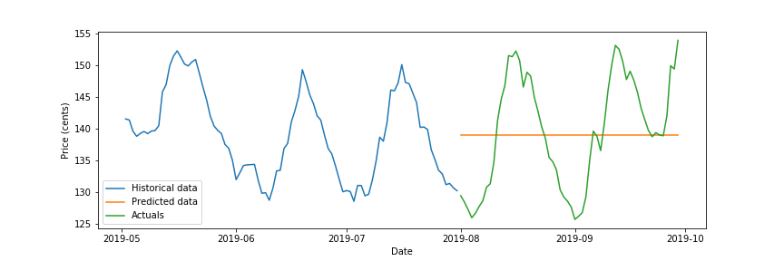
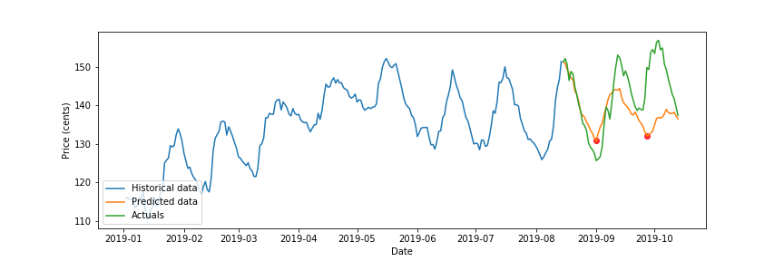
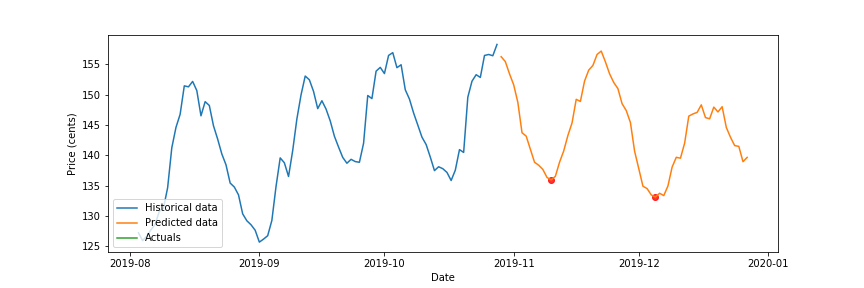

# Fuel Price
### Introduction
`fuelprice` is a Python project that analyses past fuel price data to predict future fuel prices. 

The primary application of this is to determine when is the best date in the future to refuel your vehicle.

### Overview
1. Data has been downloaded from https://data.nsw.gov.au/data/dataset/fuel-check (only up until June) as Excel files.
2. The remaining data from June to the present date has been downloaded through the fuel price API (https://api.nsw.gov.au/fuel-price-check/apis). The code for this is in my `fuelprice_download` repository. 
3. `clean_raw_website_data.py` cleans the raw website data by:
    - putting dates in the correct format
    - imputting missing values
    - removing outliers
    - formatting it into a .csv file
4. `combine_data.py` takes both the cleaned website data and the data sourced from the fuel price API and merges them together to the `all_data_cleaned.csv` file. The merge is done through:
    - matching column names
    - aligning on time zones
    - populating missing data in the cleaned website data that can be inferred from the fuel price API data
The fuel price was loaded in from `all_data_cleaned.csv`.
5. `all_data_cleaned.csv` was then used to model future prices.
6. Data was transformed to daily data by taking the daily average across all stations (a weighted average option based on distance from the user's current location is also possible). Note that this model only looks at E10 fuel only.
7. The data was split into three sets: training, test and validation
	- training will be used to train the model
	- test will be used to evaluate the performance of the model after training the model
	- validation will be used to evaluate how well the model would perform if it were asked to predict the next 60 consecutive daily fuel prices
8. A baseline model was firstly used to set a baseline. The baseline model is as follows:
	1. Take the average of the 80 most recent petrol prices
	2. Use this average as the predicted petrol price for the next 60 days. 
	3. Calculate the root mean square error from the actual price and set this as the baseline error

9. Create a list of all possible parameters to train on. This combinations include:
- what model to use
- the types of features to put in
- how the training/test data is to be split
- the date range of the data to take
10. Train all possible combinations of the model and save the results to `results.pkl`.
11. Select the model with the lowest root mean square error on the validation set.

12. Use this model to predict the next 60 fuel prices. 
13. Using the predictions, report which dates have the lowest fuel prices.

In the above case, the model will output the following:
- `On 05 December, there will be a minimum price of 133.12 cents`
- `On 10 November, there will be a minimum price of 135.95 cents`

### Data
The data has been obtained from two sources:
1. The NSW government's website: https://data.nsw.gov.au/data/dataset/fuel-check
2. The NSW government's API: https://api.nsw.gov.au/fuel-price-check/apis